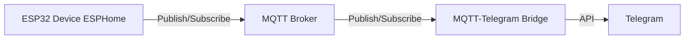

# MQTT Alarm System

This project implements an IoT-based alarm system using an ESP32 device programmed with ESPHome. The system monitors an alarm sensor (motion & door sensor & door bell), publishes events to an MQTT broker, and sends notifications to Telegram via a bridge script. This allows for real-time remote alerts when the alarm is triggered.

## System Architecture

The system consists of four main components:
1. **ESP32 with ESPHome**: Monitors the alarm sensor and publishes messages to an MQTT topic.
2. **MQTT Broker**: Acts as a central hub for communication between the ESP32 and the Telegram bridge.
3. **MQTT-Telegram Bridge**: Subscribes to the MQTT topic and sends notifications to Telegram.
4. **Telegram**: Displays alarm notifications to the user.

The following diagram illustrates the data flow:



## Prerequisites

- ESP32 development board
- MQTT broker (e.g., Mosquitto) installed and accessible on your network
- Telegram account and a Telegram bot (created via `@BotFather`)
- Rust environment for the MQTT-Telegram bridge
- ESPHome CLI for flashing the firmware

## Setup Instructions

### 1. Clone the Repository
Clone the repository to your local machine:
```bash
git clone https://github.com/Mechanix97/mqtt-broker-alarm.git
cd mqtt-broker-alarm
```

### 2. Configure ESPHome
Navigate to the `esphome` folder and edit the `esphome.yaml` file to include your WiFi credentials, MQTT broker details, and sensor configuration. An example configuration is:

```yaml
esphome:
  name: alarm-device
  platform: ESP32
  board: esp32dev

wifi:
  ssid: "Your_WiFi_SSID"
  password: "Your_WiFi_Password"

mqtt:
  broker: "mqtt.example.com"
  username: "mqtt_username"
  password: "mqtt_password"

binary_sensor:
  - platform: gpio
    pin: GPIO15
    name: "Alarm Sensor"
    on_state:
      then:
        - mqtt.publish:
            topic: "alarm/triggered"
            payload: "ON"
```

### 3. Flash the ESP32
Flash the firmware to the ESP32 using ESPHome CLI:
```bash
esphome run esphome.yaml
```
Ensure the ESP32 is connected to your computer and properly detected.

### 4. Set Up MQTT Broker
Install and configure an MQTT broker (e.g., Mosquitto) on your network. Ensure the broker is running and accessible at the specified host and port (default: 1883). Configure authentication if needed:
```bash
# Example for Mosquitto
sudo apt-get install mosquitto mosquitto-clients
# Edit /etc/mosquitto/mosquitto.conf for custom settings
```

Refer to [Mosquitto Documentation](https://mosquitto.org/) for detailed setup instructions.

### 5. Configure Telegram Bot
1. Create a Telegram bot using `@BotFather` in the Telegram app and obtain the bot token.
2. Get your chat ID using `@myidbot` or by sending a message to your bot and checking the API.
3. Update the bridge enviroment variables with these credentials at `secrets/telegram.env`.

Refer to [Telegram Bot API](https://core.telegram.org/bots/api) for more details.


### 6. Set Up MQTT-Telegram Bridge
Run the bridge program in dev mode using
```bash
make run
```

Also, to run the bridge in a docker container use:
```bash
make run-docker
```

## Usage
1. Power on the ESP32 and ensure it connects to your WiFi and MQTT broker.
2. Trigger the alarm sensor (e.g., motion or door opening) to publish a message to the `alarm/triggered` topic.
3. The MQTT-Telegram bridge will detect the message and send a notification to your Telegram chat.
4. Monitor notifications in Telegram for real-time alerts.

## Resources
- [ESPHome Documentation](https://esphome.io/) for firmware configuration
- [Mosquitto MQTT Broker](https://mosquitto.org/) for broker setup
- [Telegram Bot API](https://core.telegram.org/bots/api) for bot integration
- [Random Nerd Tutorials](https://randomnerdtutorials.com/telegram-control-esp32-esp8266-nodemcu-outputs/) for Telegram and ESP32 examples

## License
This project is licensed under the MIT License. See the `LICENSE` file for details.
